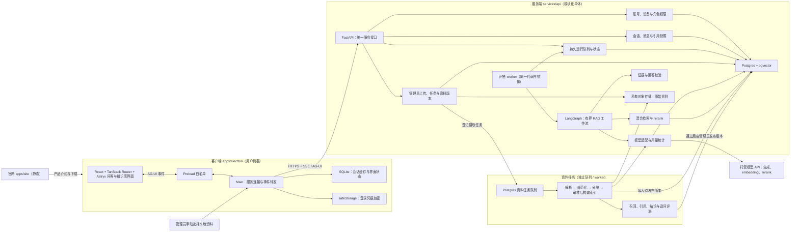
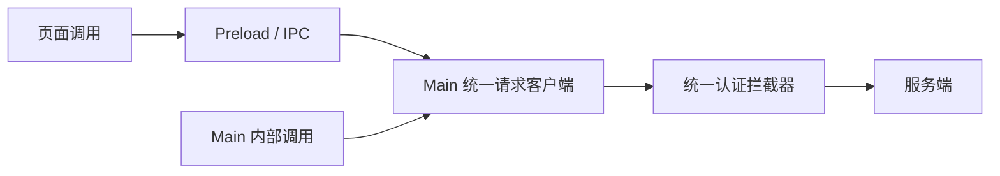
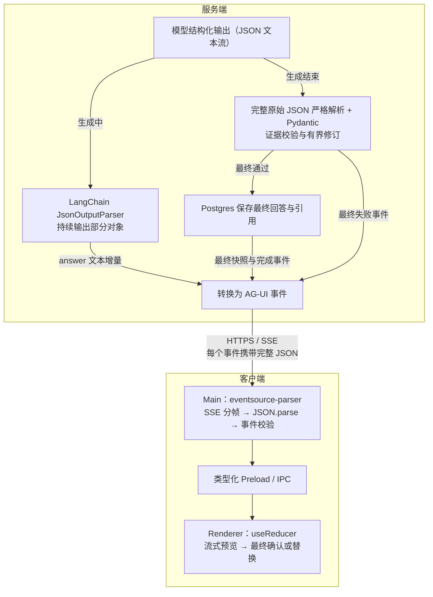

# 钩玄 架构设计

## 产品定位

钩玄是一款基于 RAG 的保险咨询问答系统，服务对象是不了解保险的人，回答三类问题：

- 哪些保险应该买。
- 哪些不必买、哪些属于重复配置。
- 什么样的产品适合自己所处的情况。

产品形态是对话问答。每条回答都要能回查到依据的条款或资料片段，让用户可以核对出处。

v1 覆盖账号登录、客户端问答会话、服务端 RAG 问答、来源展示、管理员知识库管理、模型用量记录和基础官网。全部付费能力归入 v2，v1 保留计费接入边界。

v1 使用单一部署、固定模型配置和按业务职责组织的少量模块，先完成上述闭环；后续扩展根据实际需求和运行数据再设计。

暂不包含：在线投保与下单、保单管理、健康告知与核保引导、需求画像问卷、移动客户端。

客户端统一调用服务端接口，不支持用户自定义模型端点或 API Key。服务端统一管理模型、检索、回答质量、会话持久化和用量计量，Postgres 是业务数据主存，客户端 SQLite 只保存缓存与界面状态。

## 架构



服务端 API、问答 worker 与资料 worker 共用一个 Python 应用和镜像，以模块化单体部署。管理员在客户端上传资料，服务端登记任务；资料队列和 worker 与问答执行隔离，分别控制并发。

### 问答路径

1. Renderer 把输入交给 Main（Preload 只暴露类型化白名单）。
2. Main 携带幂等键调用服务端问答接口，服务端鉴权后，在同一事务确认会话、保存用户消息、创建运行与回答候选并入队，返回各自的 ID。
3. 后台 worker 使用提交时绑定的会话修订、语料发布版本和模型配置执行有界 RAG 工作流，持久化消息、运行状态和引用快照。
4. 服务端将工作流输出转换为稳定的 AG-UI 事件，通过 SSE 传给 Main，再经类型化 IPC 流向 Renderer。
5. Main 合并写入 SQLite 缓存；运行中止、错误和最终回答都关联同一运行 ID。断线后查询服务端状态，按其结果刷新缓存。

## 技术栈

依赖版本以锁文件和兼容性验证为准。

| 模块         | 选型                                                                                                                                 | 职责与关键约束                                                                                       |
| ------------ | ------------------------------------------------------------------------------------------------------------------------------------ | ---------------------------------------------------------------------------------------------------- |
| 桌面客户端   | Electron + React + Astryx                                                                                                            | 左侧新建会话与最近会话，右侧消息列表与输入区；展示引用、运行状态和停止操作                           |
| 客户端路由   | [TanStack Router](https://tanstack.com/router/latest/docs/overview) + Hash History                                                   | 文件路由管理登录、会话与设置页面；类型化路径与参数，loader 通过 Preload 读取数据，页面切换不取消运行 |
| 客户端运行层 | Electron Main + 类型化 Preload                                                                                                       | 管理服务连接、登录凭据、事件转发与管理员文件上传；模型配置全部放服务端                               |
| 客户端请求   | [openapi-fetch](https://openapi-ts.dev/openapi-fetch/) + Electron `net.fetch`                                                        | 所有业务 HTTP 与 SSE 建连共用 Main 认证拦截器；AuthSession 管理续期与账号隔离，重试保留幂等键        |
| 客户端缓存   | SQLite（`node:sqlite`）                                                                                                              | 缓存最近会话、消息、引用快照、运行状态和界面状态；Main 管理、批量写入、按账号隔离，以服务端数据为准  |
| 服务端 API   | FastAPI + Pydantic                                                                                                                   | 会话、消息、问答运行、取消、来源查询、知识库管理与鉴权；请求和响应做运行时校验，列表使用游标分页     |
| 运行执行     | Postgres 持久任务队列 + 独立 Python worker                                                                                           | 问答与资料使用独立队列和执行进程；短事务领取、行锁与租约，运行不依赖 SSE 连接存活                    |
| RAG 编排     | [LangGraph](https://docs.langchain.com/oss/python/langgraph/overview)                                                                | 显式定义按需摘要、检索、校验、生成、修订和终止分支                                                   |
| 模型接入     | 按需使用 LangChain 模型适配组件                                                                                                      | 统一模型调用、超时、用量统计和错误处理；业务逻辑保留在独立模块                                       |
| 结构化输出   | LangChain `JsonOutputParser` + Pydantic                                                                                              | 服务端解析不完整 JSON 并输出正文增量；生成结束后严格校验原始完整输出与证据，再确认最终回答           |
| 模型部署     | 托管模型 API，服务端统一配置                                                                                                         | 生成、embedding、rerank 分别选型；具体型号用保险评测集锁定                                           |
| 关系数据库   | Postgres                                                                                                                             | 保存账号、会话、消息、引用快照、文档元数据与用量记录                                                 |
| 向量检索     | [pgvector](https://github.com/pgvector/pgvector)                                                                                     | 向量与条款元数据同库管理；v1 使用精确检索，约束产品、版本与权限                                      |
| ORM          | [SQLAlchemy 2.x](https://docs.sqlalchemy.org/en/20/)                                                                                 | 管理账号、会话、消息和条款等业务模型及事务；业务 CRUD 使用 ORM，检索使用表达式或参数化 SQL           |
| 数据库驱动   | [psycopg 3](https://www.psycopg.org/psycopg3/docs/)                                                                                  | 通过 SQLAlchemy 异步引擎统一管理数据库连接、连接池与 SQL 执行                                        |
| 数据库迁移   | [Alembic](https://alembic.sqlalchemy.org/en/latest/)                                                                                 | 版本化管理表结构与索引变更，覆盖业务表、语料元数据和检索表                                           |
| 中文词法检索 | [jieba](https://github.com/fxsjy/jieba) + Postgres 全文检索                                                                          | Python 预分词后生成 tsvector，使用 GIN 索引；保险词典、产品别名与分词配置随资料版本管理              |
| 检索策略     | 中文词法召回 + 向量召回 + RRF 融合 + rerank                                                                                          | 检索全程约束产品、版本、有效状态与访问权限；中文分词需专门验证，排序后补充完整条款上下文             |
| 语料摄取     | 独立 Python 摄取流水线                                                                                                               | 管理员手动上传文本 PDF / Markdown；分阶段执行解析、审核、embedding 与评测，管理员发布                |
| 知识库管理   | 客户端设置菜单 + FastAPI 管理接口                                                                                                    | 仅管理员可见和操作；上传、状态查看、失败阶段重试、审核、发布与回滚由服务端校验权限                   |
| 原始资料     | 私有 S3 兼容对象存储                                                                                                                 | 保存原始 PDF 与规范化产物；Postgres 保存定位、版本、内容哈希和校验信息                               |
| 会话存储     | 服务端为主，客户端缓存                                                                                                               | 最近会话从服务端获取；历史引用保存自包含快照，删除与账号切换同步处理缓存                             |
| 运行状态     | Postgres 业务记录 + LangGraph 内存状态                                                                                               | 持久化运行、消息、用量与公共事件；客户端可断线重连，执行中断明确失败，由用户重跑                     |
| 事件传输     | SSE + [AG-UI 事件语义](https://docs.ag-ui.com/concepts/events) + [eventsource-parser](https://github.com/rexxars/eventsource-parser) | 服务端转换公共事件，Main 解析 SSE 与事件载荷后转发；运行 ID 和事件序号用于关联、去重与恢复           |
| 安全与计量   | 服务端鉴权、角色授权、限流与用量记录                                                                                                 | 密钥只在服务端，登录凭据由 safeStorage 加密；密码用 Argon2id；限制请求频率、活动运行数和模型并发     |
| 部署与观测   | Docker + 模块化单体服务 + Python logging 结构化日志                                                                                  | 记录请求 ID、阶段耗时、错误和模型用量；日志默认不记录问题正文，生产配置与开发配置分开                |

## 客户端

Main 管理请求、SSE、登录会话与缓存，Renderer 使用 `useReducer` 管理消息、引用和运行状态。Preload 在 Renderer 的隔离上下文中提供类型化桥接接口。

### 账号与权限

v1 使用邮箱标识与密码登录，账号由管理员通过受控服务端 CLI 创建或重置密码。角色固定为普通用户和管理员，服务端校验会话归属与管理权限；账号初始化入口受运维权限保护，公开接口不能自行提升角色。

### 界面

- 左侧 `SideNav` 提供新建会话与最近会话列表，右侧展示对话列表与输入框，复用 Astryx 的对话、流式 Markdown 和引用组件。
- 对话区展示检索进度与流式正文，区分生成中、核验中和已完成，支持停止与重跑最新一轮；重跑期间保留原回答并展示新候选，最终正文与引用以服务端校验结果为准。
- 回答下方展示引用片段与出处，可以展开查看原文定位和资料版本。
- 登录状态、运行限制、服务不可达、断线恢复和离线历史查看具有明确界面状态。
- 支持浅色、深色和跟随系统三种主题，默认跟随系统；不使用渐变，圆角 6–8px，列表保持桌面工具密度。

### 主题与外观

- 设置中的外观选项提供「浅色」「深色」「跟随系统」，切换立即生效；跟随系统时，系统外观变化自动更新界面，无需重启。
- Main 将主题偏好作为当前账号的本地界面设置保存，重启和重新登录后恢复；无登录账号时使用跟随系统，切换账号时加载对应账号的偏好。主题设置不依赖服务端，离线也可修改。
- Main 根据偏好设置 Electron [`nativeTheme.themeSource`](https://www.electronjs.org/docs/latest/api/native-theme)，使原生界面与网页配色一致。Renderer 通过类型化 Preload 读取、更新和订阅主题偏好，根 Astryx `Theme` 使用同一 `mode`（`light`、`dark` 或 `system`），由其同步根节点与 `color-scheme`，不额外引入主题库或复制颜色表。
- 页面、对话、引用、弹层和自定义样式统一使用 Astryx 语义 token，覆盖正文、背景、边框与状态颜色；原生滚动条、表单和窗口背景与当前主题一致。窗口显示前恢复并应用偏好，避免深色启动时闪现浅色背景。
- 验收覆盖三种模式切换、系统外观实时变化、重启恢复与账号切换；浅色或深色模式不随系统变化，切换主题不重建会话、不丢失草稿、不打断运行。

### 页面路由

Renderer 使用 [TanStack Router](https://tanstack.com/router/latest/docs/overview) 管理页面切换，采用文件路由，由 Vite 插件生成路由树。路由实例在 React 渲染树外创建，使用 [Hash History](https://tanstack.com/router/latest/docs/guide/history-types)（`createHashHistory`），使打包后的本地页面支持刷新与前进、后退，路径形式为 `#/chat/<conversationId>`。

| 路由                    | 页面与行为                                                     |
| ----------------------- | -------------------------------------------------------------- |
| `/`                     | 按 Main 提供的登录状态，进入登录页或恢复当前账号上次访问的会话 |
| `/login`                | 独立登录页；登录成功后进入当前账号的会话界面                   |
| `/chat`                 | 新建会话草稿；首次提交由服务端确认后，替换为返回的会话详情路由 |
| `/chat/$conversationId` | 指定会话的历史与当前运行，参数作为当前选中会话的唯一依据       |
| `/settings`             | 账号、主题与界面偏好、管理员知识库菜单                         |
| `/settings/knowledge`   | 管理员知识库管理；上传、任务状态、失败重试、审核、发布与回滚   |

- 登录后的页面共用应用布局，保留左侧 `SideNav`，右侧通过 `Outlet` 展示当前页面。导航使用路由的 `Link` 与导航 API，列表选中状态由路由派生。
- `beforeLoad` 根据 Main 提供的当前账号与登录状态检查页面入口，离线时允许当前账号查看已缓存历史。`loader` 通过类型化 Preload 读取数据，服务端请求仍由 Main 发起；提交、重跑、删除等写操作由明确的用户交互触发。服务端独立校验数据访问权限。
- 路由只保存页面路径与导航标识，令牌、问题正文和用户事实不进入 URL。消息、引用与运行状态由 `useReducer` 按会话 ID 和运行 ID 管理，输入草稿与弹窗使用各自的界面状态。
- 路由切换不取消问答运行或关闭 Main 的 SSE 连接。页面取消旧会话的界面订阅并订阅新会话，Main 持续接收事件和更新缓存；用户点击停止才发起运行取消。
- 启动时按当前账号恢复会话路径，无有效记录则进入 `/chat`；未知路径或已确认删除、无权访问的会话显示说明并提供返回入口。退出登录或切换账号时清理旧账号的路由上下文，前进、后退仍需经过登录与账号检查。

### 知识库管理

- 设置中增加「知识库」菜单，仅管理员可见，对应 `/settings/knowledge`；直接访问路由也检查角色，服务端独立校验所有管理请求。
- v1 提供资料列表、文件上传、来源与产品版本填写、处理状态与错误查看、失败阶段重试，以及审核、发布和版本回滚。知识库属于平台，资料存储、模型调用和索引构建由服务端统一管理。
- Main 通过原生文件选择器读取选中的本地文件，Preload 暴露专用选择与上传方法，上传使用同一 HTTP 客户端与认证拦截器。Renderer 不直接读取文件或连接对象存储。
- 页面打开时按任务 ID 轮询进度，离开后停止界面轮询，服务端任务继续执行。管理员核对解析预览与原文定位，通过审核后执行索引构建和评测；满足发布条件后显式发布。

### 请求与认证

Renderer 通过类型化 Preload 调用业务方法。页面与 Main 的业务 HTTP 请求、SSE 建连和重连统一使用 Main 中的请求客户端与认证拦截器。



请求客户端在 Electron `ready` 后初始化，`openapi-fetch` 使用 [Electron `net.fetch`](https://www.electronjs.org/docs/latest/api/net) 作为底层实现，接入 Chromium 网络栈与系统代理。`onRequest`、`onResponse` 与 `onError` 中间件统一调用 `AuthSession`，由应用实现续期与重试。实现依据见 [请求中间件文档](https://openapi-ts.dev/openapi-fetch/middleware-auth)。

使用短期访问令牌与长期刷新令牌，有效期见「v1 初始配置」。访问令牌仅保存在 Main 内存，刷新令牌通过 `safeStorage` 加密后单独持久化，仅在 Main 解密使用；令牌不暴露给 Renderer。`AuthSession` 同时记录当前账号、登录代次、令牌版本与到期时间。

服务端通过稳定错误码区分访问令牌过期、刷新令牌失效与会话吊销，客户端按下表处理。

| 场景                       | 统一处理与副作用约束                                                                                                    |
| -------------------------- | ----------------------------------------------------------------------------------------------------------------------- |
| 请求受保护接口             | 请求拦截器获取当前有效访问令牌，添加 `Authorization: Bearer …`                                                          |
| 即将过期或多个请求需要续期 | 共用一个刷新任务；收到旧令牌的迟到 `401` 时先检查令牌版本，已有新令牌则直接使用，避免重复续期                           |
| 登录与续期接口             | 使用同一客户端，显式配置认证策略；登录接口无需访问令牌，续期接口禁用自动续期，避免递归                                  |
| 访问令牌过期返回 `401`     | 续期成功后最多重试一次，仅重放可重建的请求；问答提交与资料上传保留原幂等键，服务端先认证再执行业务副作用                |
| 刷新令牌失效或会话被吊销   | `AuthSession` 结束当前登录代次、清理凭据并合并通知一次 `auth:changed`；Renderer 更新路由上下文，由登录守卫转到登录页    |
| 网络错误、超时或服务端异常 | 返回可识别的错误并保留登录状态，不因续期暂时失败清除凭据；网络结果不明确时不盲目重发写请求                              |
| 无访问权限或达到运行限制   | 返回对应业务错误，`403`、`429` 不触发令牌续期或退出登录                                                                 |
| 退出登录或切换账号         | 增加登录代次，停止旧请求与订阅，丢弃旧响应及旧续期结果；账号缓存清理由存储模块按「缓存与同步」规则执行                  |
| 错误跨 IPC 传递            | 返回包含错误码、提示、请求 ID 和是否可重试的结构化结果；Renderer 统一处理登录跳转与提示，避免多个请求重复弹窗或反复跳转 |

`AuthSession` 管理登录生命周期，业务模块管理缓存，Renderer 管理页面跳转与提示。跨 IPC 的错误使用结构化结果，不依赖原始 `Error` 的自定义属性，参见 [Electron IPC 错误说明](https://www.electronjs.org/docs/latest/api/ipc-main#ipcmainhandlechannel-listener)。

SSE 请求使用 `parseAs: "stream"`，认证拦截器只检查成功响应的状态码与响应头，不提前读取正文。SSE 管理模块负责断流与重连，每次重连使用最新有效令牌；运行恢复遵循「运行、取消与恢复」规则。普通 HTTP 使用请求超时，SSE 分别管理连接建立超时与心跳空闲超时。流式响应支持见 [openapi-fetch API](https://openapi-ts.dev/openapi-fetch/api)。

### 缓存与同步

离线只能查看已缓存历史；新建问答、重跑、服务端刷新与修改需要网络连接。

- 缓存数据库仅由 Main 内的存储模块访问，不向 Renderer 暴露 SQL 或文件接口。验证 `node:sqlite` 与 Electron 内建 Node 的兼容性，合并批量写入，不逐 token 写库，并检查 Main 线程阻塞时间。输入草稿、上次访问的会话路径与界面偏好按账号保存。
- 消息、引用、运行状态与该运行连续已应用的事件序号在同一个 SQLite 批量事务中保存，终态事件立即提交。只有已落库的序号用于断线或重启恢复，不能以刚收到的最大序号推进恢复位置；重放事件按运行 ID 与序号去重。
- 启动、窗口重新获得焦点或打开会话时先展示缓存，再刷新最近会话和当前会话；通过服务端消息 ID、运行 ID 和会话修订号合并，避免重复消息与旧响应覆盖新状态。
- 新建问答、重跑、删除等操作先由服务端确认，再更新本地缓存；不维护离线业务写入队列。缓存的运行状态在重连时必须重新核对。
- 最近会话列表使用普通分页，不能将未出现在某一页的会话当成已删除。Main 在启动、恢复网络或窗口重新获得焦点时，通过批量核对接口提交本地缓存的会话 ID；服务端对每个 ID 返回可访问状态和当前修订号，修订变化的消息按需刷新。核对请求失败时保留原缓存，标为待刷新。
- 服务端明确返回已删除或不可访问时，本地清理该会话的消息、引用和草稿，停止对应订阅，并丢弃迟到响应。当前账号其他有效草稿与偏好保留；本地删除标记防止旧事件重新创建已清理会话。
- 缓存按账号隔离，退出登录清理该账号缓存；写入前检查请求或订阅绑定的账号与登录代次，丢弃旧账号的迟到结果。
- 缓存设置容量与过期策略，SQLite 表结构用本地 schema 版本管理；损坏时可清空历史缓存并从服务端重建。

## 问答服务

### 接口与契约

- 业务路由使用 `/v1/`，对外提供账号、会话列表与历史、缓存会话 ID 批量核对、问答提交与重跑、运行状态与取消、来源查询及管理员知识库接口；知识库接口覆盖上传、任务状态、失败阶段重试、审核、发布和回滚。批量核对只读取数据，单次最多 100 个 ID，逐一返回结果并校验归属。HTTP 契约由 Pydantic 导出为 `openapi.json` 并进入 git，客户端用 `openapi-typescript` 生成类型，CI 检查重新生成后无差异。IPC 参数与公共事件另做运行时校验并维护兼容性。
- `/healthz` 检查进程存活，`/readyz` 检查数据库与必要迁移，分别报告对象存储、两类 worker 心跳和问答就绪状态。问答就绪要求有效的已发布语料、兼容的向量维度与可查询索引、模型配置和可用问答 worker；尚无已发布语料时，账号与具备自身依赖的知识库接口仍可用，普通问答返回资料未就绪。
- 错误分类区分服务不可达、鉴权失败、资料未就绪、运行限制、资料处理失败和模型供应商异常；供应商异常在问答运行中报告。

### 回答质量流程

| 步骤          | 行为                                             | 终止与质量约束                                               |
| ------------- | ------------------------------------------------ | ------------------------------------------------------------ |
| 1. 理解问题   | 结合必要用户事实、历史摘要与近期原文解析咨询条件 | 历史与证据受上下文预算限制；缺少必要事实时追问并结束本次运行 |
| 2. 准备检索   | 生成独立检索问题与明确过滤条件                   | 保留用户原意，不补造个人信息                                 |
| 3. 检索与排序 | 混合召回、rerank、补充相关定义与完整条款         | 固定本次使用的语料和索引版本                                 |
| 4. 检查证据   | 检查相关性、覆盖程度和来源冲突                   | 最多两轮检索，包含首次；没有新证据则提前停止                 |
| 5. 生成预览   | 仅依据证据生成结论、条件和引用，正文流式展示     | 预览标记为生成中，无依据的内容不进入确定性结论               |
| 6. 校验与修订 | 程序检查引用与版本，模型辅助检查证据支持程度     | 最多修订一次，并受总耗时与 token 预算限制                    |
| 7. 输出结果   | 输出通过校验的回答、来源与资料版本               | 仍缺证据时返回有依据的部分并说明缺口；需要补充用户事实时追问 |
| 8. 持续评测   | 人工核对的保险案例覆盖召回、引用、结论和追问     | 模型、prompt、分块或检索策略变更必须跑回归                   |

程序校验确保引用 ID 属于本次证据集、产品与文档版本匹配。模型校验辅助判断结论是否得到证据支持及是否遗漏限制条件，不能将模型评分作为唯一通过条件。来源冲突未解决时明确说明冲突，不给出确定性结论。

v1 上下文使用当前问题、历史摘要、预算内的近期生效消息与本次证据。条款用于说明具体保障，经审核的咨询知识用于说明配置原则，两类来源在回答中明确区分。

- 历史超过分配的 token 预算时，由问答 worker 复用现有生成模型，将旧摘要与新增的较早生效消息压缩为新摘要；默认保留最近两轮完整对话原文。摘要与原文都受输入预算限制，当前问题及必要证据优先，每次运行最多生成一次摘要，不随检索循环重复。
- 摘要只保留咨询主题、用户明确提供的信息和待解决问题，用户信息附原始 `userMessageId`，关键事实使用前回查原消息；较新的用户说明优先，冲突不明确时追问。摘要和此前模型回答不作为保险结论的证据，失败或取消的预览不参与摘要。
- Postgres 在会话上保存一份摘要、覆盖到的消息 ID 与摘要配置版本，原消息仍完整保留。读取时校验覆盖范围与生效历史，重跑只使用当前问题之前的内容；不匹配的摘要重新生成。写回遵守运行租约、会话修订与删除检查，摘要随会话删除。
- 摘要失败、超时或不符合格式时保留原有效摘要，按预算截取近期原文继续问答；必要事实缺失时追问。摘要调用计入所属运行的耗时和用量，默认限制见「v1 初始配置」。

条款解读需要明确产品与资料版本；个性化配置仅追问影响结论的年龄段、预算和已有保障。缺少必要事实、条款或经审核原则时说明缺口，追问通过对话完成。

### 结构化流式输出

服务端通过模型原生的 JSON Schema 能力约束回答结构，将原始 JSON 文本流交给 LangChain 的 [JsonOutputParser](https://reference.langchain.com/python/langchain-core/output_parsers/json/JsonOutputParser)。解析器持续输出部分对象，包括尚未闭合的字符串，服务端据此提取 `answer` 的文本增量。



- **流式预览**：累计模型输出从 `{"answer":"你` 增长到 `{"answer":"你好` 时，解析器分别给出 `{"answer":"你"}` 与 `{"answer":"你好"}`。服务端比较 `answer` 的变化，通过 `TEXT_MESSAGE_CONTENT` 依次发送 `"你"`、`"好"`；事件与预览消息绑定同一运行 ID 和消息 ID，引用在校验后展示。
- **最终确认**：对完整原始输出执行严格 JSON 与 Pydantic 校验，并通过前述证据核验。解析器补齐的部分对象仅用于预览。最终结果持久化后，用 `MESSAGES_SNAPSHOT` 同步该会话的权威消息列表，确认或替换同一候选消息的预览并更新本轮生效回答，再发送 `RUN_FINISHED`；历史回答候选单独保留，不重复进入当前对话列表。
- **状态与失败**：`TEXT_MESSAGE_END` 只表示文本流结束，不代表运行完成；核验状态由阶段事件驱动，校验最终失败时发送 `RUN_ERROR`。取消或异常中断的预览标为未完成，不保存为已完成的回答，也不用于后续问答的事实或证据。

### 运行、取消与恢复

- 提交与重跑携带按账号隔离的幂等键。鉴权后先查询幂等结果，相同键与载荷返回同一组 `conversationId`、`userMessageId`、`runId`、`assistantMessageId`，运行已结束也不再次创建；同键不同载荷返回冲突。数据库唯一约束与事务内复查保证并发重复提交也返回同一结果；响应丢失时按原键恢复提交结果，不生成新键。
- 首次提交在一个短事务中创建会话、用户消息、运行、回答候选与队列任务，并保存幂等结果；事务内锁定账号及已有会话，检查归属、修订与运行限制。失败整体回滚，客户端收到确认后才切换会话路由与清理已提交草稿。同一会话最多一个活动运行，覆盖排队与执行阶段，运行结束前不能提交下一轮或再次重跑。
- v1 只重跑最新用户消息，复用其 `userMessageId`，创建新的运行与回答候选，不重复插入用户消息。以该消息作为当前问题，历史上下文截止到它之前，不包含本轮旧回答或失败预览；每次运行在创建时绑定会话修订、`corpusReleaseId` 与模型配置，排队后发布版本变化不改变本次依据。
- 重跑期间保留原生效回答，新候选通过校验且运行仍可完成时，在终态事务中保存正文与引用、切换本轮生效回答并生成最终事件。失败或取消保留原生效回答；没有原生效回答时展示未完成状态。旧回答及各候选的运行关系可追溯，后续问答只读取生效的会话历史。
- 独立 worker 领取已入队运行后执行 LangGraph。领取使用短事务与 `FOR UPDATE SKIP LOCKED`，不在模型调用期间持有数据库事务；租约与心跳管理任务归属，写入进度、公共事件或结果的事务必须校验租约代次、有效期、运行仍在执行且会话未删除。过期 worker 和终态后的迟到写入不能提交。该用法限定于任务队列，参见 [Postgres 行锁文档](https://www.postgresql.org/docs/current/sql-select.html#SQL-FOR-UPDATE-SHARE)。
- 阶段进度与终态事件区分开，运行以完成、取消或失败收尾，追问也作为完整结果保存。终态事务只允许执行一次；取消、删除和失败收尾使执行租约失效，终态后仅允许补录不含会话内容的迟到用量。
- v1 的 LangGraph 状态仅保留在 worker 内存。API 运行服务定期将执行租约过期或预算耗尽的运行标为失败，客户端展示原因并允许重跑最新一轮；尚未领取的排队任务正常执行，执行中断不自动重新入队或断点续跑。客户端断线不影响仍在执行的 worker。
- 模型超时与重试共用本次执行预算，默认值见「v1 初始配置」；供应商已执行而调用结果不明确时不盲目重复调用，回答生成等必要调用失败则将运行标为失败，摘要失败按上述规则降级。保留已知用量，无法确定的调用标记为待核对，不能当成零用量。
- 停止操作调用服务端取消接口，服务端传播取消信号并关闭模型流；断开 SSE 连接不自动等同于用户取消。断线后客户端查询运行状态并重新获取已确认的消息和引用。
- 成功、失败和取消均保留已产生的模型用量。用量按调用 ID 幂等记录，避免重连或恢复重复统计同一次调用；实际重试产生的新调用分别记录。
- 公共事件短期持久化，最终回答、引用和终态先提交数据库再发送，API 从公共事件记录输出 SSE。事件带运行 ID 与递增序号，重连从已确认序号继续；超过事件保留期则获取状态和消息快照，客户端去重。重连不重新提交问答。
- 账号请求频率、排队长度、每账号活动运行数及全局模型并发有上限。HTTPS 入口配置 SSE 心跳、空闲超时与不缓冲事件；观测覆盖排队时间、阶段耗时、失败率、校验失败和模型用量。

### 用量记录与 v2 计费接入

模型网关按账号、运行与调用 ID 保存供应商、模型和配置版本、供应商请求 ID、输入输出 token 或供应商计量单位、耗时、状态及用量是否已确认。语料 embedding 与评测调用关联资料任务 ID，和用户问答用量分开归类；记录不包含问题、回答或检索原文。

| 接入位置           | v1 职责                          | v2 接入内容                                    |
| ------------------ | -------------------------------- | ---------------------------------------------- |
| 运行服务创建入口   | 鉴权、限流、预算检查与幂等入队   | 能量余额检查与预占，复用运行创建事务           |
| 模型网关           | 记录真实调用与用量               | 根据计价版本换算能量或费用                     |
| 运行服务终态入口   | 完成、取消、失败统一收尾并持久化 | 结算或释放预占，与终态保持事务一致             |
| 设置路由与错误契约 | 类型化页面入口与结构化业务错误   | 增加余额、充值、消费记录、订阅页面及对应错误码 |

v1 的计费接入点就是现有运行创建、终态处理和用量记录函数，RAG 节点只负责问答流程。钱包、订单、账务表和支付 SDK 随 v2 创建。

## 数据与存储

### 数据归属

| 平面         | 存什么                                                                 | 谁持有                       | 生命周期                         |
| ------------ | ---------------------------------------------------------------------- | ---------------------------- | -------------------------------- |
| 客户端缓存   | 最近会话、消息、引用快照、运行状态、界面状态                           | SQLite；登录凭据密文单独保存 | 历史缓存可清理并从服务端重建     |
| 会话与运行   | 会话、摘要及覆盖范围、用户消息、回答候选及生效关系、引用快照与运行记录 | Postgres                     | 按账号、删除请求和保留策略管理   |
| 模型用量     | 按调用 ID 记录模型、计量单位、状态与关联运行或资料任务                 | Postgres                     | 最小字段保留，独立于会话内容清理 |
| 执行与事件   | 问答与资料任务、租约、心跳与公共事件                                   | Postgres                     | 任务按终态清理，事件短期保留     |
| 账号         | 用户、角色、凭据哈希、设备与令牌哈希                                   | Postgres                     | 账号存在期间，令牌可过期与吊销   |
| 内容真源     | 语料原文、规范化文本、条款定位、来源元数据                             | 私有对象存储 + Postgres      | 保留授权、审核及版本记录         |
| 派生检索数据 | 条款分块、词法索引、pgvector 向量与整库发布 manifest                   | Postgres                     | 可重建，保留可回滚的发布版本     |

引用快照保存原文片段、文档标题、条款或页码定位、出处和版本，不能只存 chunk ID。资料更新与迁移后，历史回答仍可独立核对依据。

### 语料上传与摄取

- v1 接收文本 PDF 和 UTF-8 Markdown，PDF 使用 pypdf 解析；文件类型、大小与可解析性由服务端校验，默认大小限制见「v1 初始配置」。扫描件和无法保留定位的复杂内容提示处理失败，由管理员转换后重新上传。
- PDF 解析在资料 worker 的受限子进程中执行，检查页数与提取字符数，并限制内存和耗时；Markdown 使用相同字符上限。索引与评测阶段各有执行预算，待审核和待发布不计执行耗时；超限终止当前阶段并保存可识别的失败原因，默认值见「v1 初始配置」。
- 上传登记标题、来源、资料类型（产品条款或咨询知识）、产品与文档版本、生效日期、使用与展示权限、上传人和内容哈希。管理员选择上传文件，来源地址只作为元数据保存。
- 原始文件确认写入私有对象存储后，在同一事务登记资料元数据与摄取任务。上传使用幂等标识，重复请求返回已有任务；未完成上传与未关联文件按过期策略清理。
- 资料任务分为待处理、解析中、待审核、索引构建中、评测中、待发布、已发布和失败。资料 worker 使用独立队列、租约与并发限制，等待审核或发布时不占用 worker；管理员操作登记下一阶段任务。
- 明确可安全重试的临时错误最多自动重试一次，仍受阶段总预算限制；解析失败、资源超限、执行租约过期或模型调用结果不明直接标为失败，过期阶段由 API 定期检查并收尾。管理员可在失败任务上显式重试当前阶段，复用已确认的产物；重试请求使用幂等键，在同一事务更新任务与入队并增加执行代次，迟到结果不能覆盖当前阶段。
- 新资料形成独立文档版本，通过人工审核后加入候选整库发布版本，完成索引检查和基础评测，再由管理员发布。任务重试按文档版本、索引配置与阶段去重；发布及回滚按下述 manifest 规则执行。

### 检索与迁移

- 业务 CRUD、检索查询共用 SQLAlchemy 连接池与事务，业务表与检索表使用 Alembic 迁移。不在问答请求中创建表或重建索引。
- 摄取与在线检索共用条款、版本和向量字段定义。整库发布 manifest 绑定 embedding 模型、维度、分块及词法配置与对应索引产物，query embedding 使用相同模型及维度；摄取负责分块，检索在指定 `corpusReleaseId` 的完整文档集合内命中并补充上下文。配置变化时构建兼容的新索引，不混用旧向量。
- 中文词法检索由 Python 使用 jieba 搜索分词与保险词典预处理，保留原文另存分词结果，通过 Postgres `simple` 配置生成 `tsvector` 并使用 GIN 索引。文档与查询使用一致的规范化、词典和分词配置，产品编号与别名同时保留结构化精确匹配字段。实现依据见 [jieba 文档](https://github.com/fxsjy/jieba)与 [Postgres 全文索引文档](https://www.postgresql.org/docs/current/textsearch-indexes.html)。
- v1 的 pgvector 使用精确检索，先验证真实语料中的产品、版本和权限过滤，以及当前负载下的召回与延迟；近似索引根据后续性能数据再引入。

### 版本发布与评测

- `documentVersionId` 标识单份资料的不可变内容与来源版本，`corpusReleaseId` 标识整库的一次发布。manifest 保存完整文档版本集合、索引产物及检索配置，在评测前冻结且不可修改；增删资料或改变配置需要创建新候选版本。
- 候选 manifest 从当前已发布版本复制，首次发布从空集合开始；新增资料保留其余文档，更新资料只替换明确指定的文档版本。发布在事务中校验候选的基准版本仍为当前版本，再切换整库指针；发生并发发布冲突时提示管理员基于新版本重新生成候选并评测。回滚切换至完整旧 manifest，运行按创建时绑定的版本继续执行。
- 发布前评测通过服务端内部入口显式指定候选 `corpusReleaseId`，复用问答工作流，独立检查候选资料已审核、索引可查询及模型配置有效，不依赖普通问答的已发布语料就绪检查。候选权限仅供管理员资料任务和内部评测使用，普通用户提交始终绑定当前已发布版本，因此首批资料可先评测再发布。
- 评测结果绑定候选 manifest、生成模型、reranker、prompt、预算与 golden 集版本；管理员发布只接受与待发布配置一致的通过结果。配置变更后重新评测，旧结果不能沿用。运行记录固定同一组模型与预算配置。
- v1 基础评测覆盖正常条款问答、没有证据、版本冲突、缺少用户事实、追问、范围外问题，以及长会话摘要、用户事实更正与摘要失败降级。程序检查引用归属与版本，人工复核结论和限制条件；固定验收样本中的无依据确定性结论、错误产品或版本引用必须修复后发布。

私有 golden 集用于端到端质量回归，与语料一起由私有存储管理并记录版本。`tests/` 使用不含私有资料的小样本 fixture 验证业务、事务、检索与工作流分支。发布记录关联 manifest、配置与评测结果，以便回归和回滚。

### 保留、删除与恢复

- 会话保留至用户主动删除；删除事务使活动租约失效，清理摘要、消息、引用快照和公共事件，已删除会话 ID 不再复用。用量记录保留最小计量字段，离线设备在恢复网络并核对缓存 ID 后清理对应内容；保留期限见「v1 初始配置」。
- 仍被活动运行或可回滚 manifest 引用的文档与索引产物不得清理；历史引用快照独立于在线索引保留。
- 原始资料和业务数据每日备份，备份保留 7 天，首次上线前验证恢复，发布产物及 manifest 支持回滚。删除清单单独持久化，恢复后重放删除记录，备份中的已删除内容随轮转清理。

## 安全边界

- Renderer 开启 `sandbox` 与 `contextIsolation`，关闭 `nodeIntegration`，使用严格 CSP，禁止远程脚本、远程页面、任意导航和新窗口。
- Preload 只暴露类型化白名单接口，Main 校验 IPC sender 与参数，不把通用 `ipcRenderer` 交给 Renderer。
- 客户端只连接平台明确配置的服务地址，使用 HTTPS，本地开发允许 `http://127.0.0.1`。模型供应商与私有存储由服务端访问，客户端没有自定义模型配置入口。
- 引用在客户端展示文本快照或通过授权接口查询。Main 显式限制导航与新窗口，Markdown 链接和图片按白名单处理，不自动请求任意远程地址。
- 检索片段作为资料而非指令处理，内部推理、模型 prompt 和校验修订草稿不通过公共事件暴露；正文预览只包含公开回答字段。
- 登录令牌不进入日志或 SQLite 缓存。模型密钥通过部署配置注入，只在服务端使用，不写入运行快照。
- 服务端只保存不透明令牌哈希，并实现有效期、续期和设备吊销。模型供应商调用只发送本次所需的历史与证据，部署时确认供应商的数据保留配置。
- 刷新令牌轮换并检测重放，账号停用、密码重置或设备吊销后撤销对应会话；管理员权限检查覆盖上传、任务重试、审核、发布和回滚。
- 服务端校验会话、运行和来源的访问权限，运行日志默认不记录问题、回答和检索原文。

## 许可

代码采用 AGPL-3.0-only，产品采用自运营托管部署，商业收费能力在 v2 接入。分发桌面端的源码提供安排与依赖扫描结果见 README 的许可节。

保险语料、索引产物与评测集不在代码许可覆盖范围内，也不进公开仓库，分别记录使用与展示权限，在资料发布前核验。

## 工程与部署

### 仓库与工具链

pnpm 11.9.0 workspace（`apps/*`）+ turbo 2.11.5；`services/api` 用 uv 独立管理。

根目录负责 workspace、任务编排、共享检查配置与 Compose；应用专属的构建与运行配置放在各自目录，业务代码按应用组织。

| 路径            | 标识                | 角色                | 工具链                      | 属于 workspace |
| --------------- | ------------------- | ------------------- | --------------------------- | -------------- |
| `apps/electron` | `@gouxuan/electron` | Electron 问答客户端 | electron-vite、React、TS    | 是             |
| `apps/site`     | `@gouxuan/site`     | 产品官网            | Vite、React                 | 是             |
| `services/api`  | `gouxuan-api`       | RAG 问答与语料服务  | Python、FastAPI、uv、Docker | 否             |

`apps/site` 使用 Vite + React 19 + Astryx，与客户端通过相同依赖共用 token、组件和 StyleX 样式管线，产物纯静态。v1 内容包含产品介绍、能力与咨询范围、下载、使用说明及 FAQ。项目自有组件产生实际复用后，再提取 `packages/ui` 并接入 workspace。

### 客户端目录

保留 Main、Preload 与 Renderer 的进程边界，业务代码按下列目标结构组织；目录与文件随实际功能落地创建。

```text
apps/electron/src/
|-- main/
|   |-- index.ts                  应用启动与模块组装
|   |-- auth.ts                   登录生命周期与凭据
|   |-- request.ts                HTTP 客户端与认证拦截器
|   |-- stream.ts                 SSE 订阅、重连与事件转发
|   |-- cache.ts                  SQLite、草稿与偏好
|   `-- ipc.ts                    IPC 注册、sender 与参数校验
|-- preload/
|   `-- index.ts                  类型化白名单桥接
|-- shared/
|   |-- api.generated.ts          从服务端 OpenAPI 生成的 HTTP 类型
|   |-- ipc.ts                    桥接方法与参数、返回结构
|   |-- events.ts                 公共事件契约
|   `-- errors.ts                 跨 IPC 的错误结构
`-- renderer/
    |-- index.html
    `-- src/
        |-- routes/               路由声明、布局、守卫与 loader
        |-- pages/
        |   |-- Login/
        |   |-- Chat/
        |   |-- Settings/
        |   `-- Knowledge/
        |-- components/           跨页面共享组件
        |-- hooks/                跨页面共享 hooks
        |-- App.tsx
        |-- main.tsx
        `-- styles.css
```

- `shared/` 只放浏览器兼容的契约类型与校验定义，Main、Preload 和 Renderer 均可引用；HTTP 类型从 `services/api/openapi.json` 生成。业务实现放在所属进程内，Renderer 通过 Preload 访问 Main。
- 页面模块以主组件命名，页面私有组件和 hooks 放在该模块的 `components/` 与 `hooks/`；页面 `api.ts` 只封装 Preload 调用，HTTP 请求由 Main 执行。`routes/` 负责路由入口，页面业务保留在 `pages/`。

### 服务端目录

应用代码位于 `app/`，先按业务职责组织为少量文件；文件内部用函数和数据模型分工，代码规模需要时再拆为包。`app/api/` 负责 HTTP 参数、响应和业务入口调用，流程放在对应业务模块，`models.py` 只定义 SQLAlchemy ORM 模型。Pydantic 请求与响应结构先跟随对应接口模块，出现实际复用后再提取。

```
services/api/
├─ pyproject.toml   uv.lock
├─ Dockerfile       .dockerignore
├─ openapi.json                    HTTP 契约产物，进 git
├─ app/
│   ├─ main.py                     FastAPI 实例、路由与错误处理
│   ├─ settings.py                 连接、固定模型、分块与预算配置
│   ├─ database.py   models.py     SQLAlchemy 连接与业务 ORM 模型
│   ├─ auth.py                     密码、令牌与角色校验
│   ├─ execution.py                运行创建、入队、租约与终态处理
│   ├─ worker.py                   问答与资料的两个独立执行入口
│   ├─ qa.py                       历史摘要、LangGraph 流程、回答校验与 AG-UI 事件
│   ├─ retrieval.py                中文分词、混合召回与 rerank
│   ├─ model_gateway.py            选定模型的调用、错误与用量记录
│   ├─ ingest.py                   解析、分块、审核、索引、评测与发布
│   ├─ objects.py                  私有文件存储
│   ├─ admin_cli.py   openapi.py    账号初始化与契约导出
│   └─ api/
│       ├─ health.py   auth.py     健康状态与账号接口
│       ├─ conversations.py        会话、缓存 ID 核对与引用来源
│       ├─ runs.py                 问答提交、事件、状态与取消
│       └─ knowledge.py            资料上传、处理、审核与发布
├─ migrations/                     Alembic 迁移脚本
├─ tests/                          关键业务验证
│   └─ fixtures/                   可公开、不含私有资料的小样本
├─ eval/
│   └─ run.py                      复用问答流程的固定样本评测
└─ data/                           私有资料本地副本与临时产物，不进 git
    └─ eval/
        └─ golden.yaml             私有评测集的本地副本
```

评测执行逻辑复用 `app/` 中的业务流程，`eval/run.py` 作为脚本入口。私有 golden 集仍以私有存储中的版本为准，本地副本统一放在已忽略的 `data/` 中。

### 部署形态

| 部分     | 载体                                                                      | 谁在什么时候跑                                 |
| -------- | ------------------------------------------------------------------------- | ---------------------------------------------- |
| 客户端   | 签名后的 DMG / zip                                                        | 用户机器常驻                                   |
| 服务端   | API / 问答 worker / 资料 worker 容器 + Postgres / pgvector + 私有对象存储 | 平台统一托管                                   |
| 资料任务 | 客户端管理员入口 + 服务端队列与资料 worker                                | 上传后执行，审核后继续，评测通过后由管理员发布 |
| 官网     | 静态产物                                                                  | 任意静态托管                                   |

API 镜像使用 uv 多阶段构建与 `BASE` 构建参数。生产 Compose 配置 API、问答 worker、资料 worker、Postgres / pgvector、对象存储连接、持久卷、密钥注入、HTTPS 入口与恢复策略。v1 在单一部署中分别控制两类 worker 的并发，开发 override 挂载 `app/` 源码并启用 `--reload`，生产显式选择独立 Compose 配置，不加载开发源码挂载与 `--reload`。

首次启动按以下顺序执行，API 与两类 worker 使用同一镜像版本和配置。

| 顺序 | 操作                                                | 完成条件                                                                                             |
| ---- | --------------------------------------------------- | ---------------------------------------------------------------------------------------------------- |
| 1    | 配置数据库、私有对象存储与模型连接                  | 开发可使用测试适配器；真实摄取与评测前配置实际模型和一致的向量维度                                   |
| 2    | 启动 Postgres / pgvector，准备对象存储与私有 bucket | 开发 Compose 提供本地 S3 兼容存储，生产连接私有托管存储；数据持久化、连接与权限检查通过              |
| 3    | 单次执行迁移任务                                    | 安装所需扩展并迁移业务与检索表；失败则不启动 API 与 worker                                           |
| 4    | 通过受控 CLI 初始化首个管理员                       | 迁移完成后创建，重复初始化不覆盖已有账号或密码；不依赖已发布语料                                     |
| 5    | 启动 API、问答 worker 与资料 worker                 | 健康检查与 worker 心跳正常，任务可领取；空库可登录、上传和审核，首批候选评测通过后发布并开放普通问答 |

`pnpm dev:api` 编排基础设施、迁移任务、API 与两类 worker 的完整开发栈，首次管理员通过独立 CLI 初始化。各进程启动前检查迁移版本，不自行修改表结构；生产迁移作为部署步骤只执行一次。

### 检查与持续集成

本地入口统一在根 `package.json`，客户端使用 `pnpm dev`、`pnpm check`、`pnpm build`、`pnpm package:mac`，服务端使用 `pnpm dev:api` 与 `pnpm check:api`。

质量入口为 `pnpm check`（prettier + eslint + typecheck）与 `pnpm check:api`（ruff check + format check + pyright + pytest + 契约 diff）。提交钩子使用 husky + lint-staged，commitlint 管理提交信息格式。

`pnpm check:api` 在宿主机通过 uv 执行，Python 格式化由 Ruff 负责；`openapi.json` 由契约生成器维护并列入 `.prettierignore`。

GitHub Actions 按栈拆 workflow，用原生 `paths:` 过滤，依赖安装统一使用 `--frozen-lockfile` / `--locked`。

| workflow     | 触发路径                                                | 步骤                                                                            |
| ------------ | ------------------------------------------------------- | ------------------------------------------------------------------------------- |
| `client.yml` | `apps/electron/**`、共享根配置、锁文件与 `openapi.json` | `pnpm install --frozen-lockfile` → JS 检查与客户端构建 → 客户端契约类型生成检查 |
| `site.yml`   | `apps/site/**`、共享根配置与锁文件                      | JS 检查与官网构建                                                               |
| `api.yml`    | `services/api/**`、Compose 配置与根检查脚本             | `uv sync --locked` → `pnpm check:api` → `docker build`                          |

CI 覆盖 Postgres / pgvector 集成测试与迁移检查，问答发布使用固定版本的私有评测集验证；v1 评测由脚本输出报告并人工复核。

### 产品标识与发布

包名 `@gouxuan/*`，`productName` 为 `Gouxuan`，中文显示名为钩玄，`appId` 为 `com.openchic.gouxuan`，用户数据目录使用 `Gouxuan`。安装包与压缩产物名固定 ASCII（`Gouxuan-<version>.dmg`），显示名与产物名分开，避免非 ASCII 文件名进入签名与公证链路。

桌面端通过手动下载安装包更新，macOS 打包使用独立 release workflow。发布前验证 Electron 支持版本、签名、公证、安装启动及旧客户端契约兼容性。

## v1 初始配置

以下数值作为开发初值，由配置管理。压测与真实模型联调后调整，语料和运行记录绑定当时的配置版本；公共事件的保留期限从运行终态开始计算，活动运行不按终态保留期限清理。

| 参数             | 开发初值                                                                                             |
| ---------------- | ---------------------------------------------------------------------------------------------------- |
| 访问令牌有效期   | 15 分钟                                                                                              |
| 刷新令牌有效期   | 30 天，续期轮换并支持吊销                                                                            |
| 单文件上传上限   | 20MB                                                                                                 |
| 资料内容上限     | PDF 最多 500 页，单份 PDF / Markdown 最多提取 100 万字符                                             |
| PDF 解析限制     | 子进程内存 512MiB，解析总时长 60 秒                                                                  |
| 资料执行限制     | 索引、评测阶段各 30 分钟，安全的临时错误最多自动重试 1 次                                            |
| 单次运行执行预算 | 90 秒，摘要、检索、生成、校验与重试共享；排队耗时单独记录                                            |
| 历史自动摘要     | 历史超过输入分配预算时触发，近期保留 2 轮原文；摘要最多 512 输出 token、10 秒，每次运行最多调用 1 次 |
| 账号运行限制     | 每分钟最多提交 10 次，每账号最多 2 个活动运行，同一会话最多 1 个                                     |
| worker 并发      | 问答执行 4 个，资料任务 1 个；模型调用另受供应商并发限制                                             |
| 公共事件         | 终态后保留 24 小时                                                                                   |
| 客户端历史缓存   | 最近 30 天、最多 100 个会话，目标容量 200MB；按最近访问清理，草稿与偏好独立保存                      |
| 用量记录         | 保留 30 天，清理会话内容后仅保留最小计量字段                                                         |

生成、embedding 与 rerank 各固定一个服务端模型。连接与密钥通过环境变量注入，模型参数、prompt、分块和预算使用一份版本化配置，运行与资料保存配置标识及必要快照，密钥除外。开发阶段使用测试适配器和合成 fixture 完成接口与工作流联调，真实模型和语料按下表验收。

## v1 联调与上线条件

这些事项按对应阶段落实，不影响先开发账号、界面、接口、任务与缓存。

| 阶段             | 必须落实的事项                                                                                                                        |
| ---------------- | ------------------------------------------------------------------------------------------------------------------------------------- |
| 首次真实入库前   | 管理员提供符合 v1 格式的首批资料，明确产品、版本、来源、使用与展示权限及审核人；确定 embedding 模型与维度，摄取与查询保持一致         |
| 真实问答联调前   | 配置生成与 rerank 模型、供应商区域、密钥、上下文与输出预算，验证结构化输出和流式解析，核算完整运行用量                                |
| 资料与问答发布前 | 准备人工核对的基础评测集，显式评测候选整库版本，通过引用、版本、结论与追问检查后发布；确认咨询原则及用户可见的能力范围和说明文案      |
| 对外上线前       | 确定服务与私有存储托管位置，检查供应商数据保留配置；完成目标负载验证、HTTPS、备份恢复、安装包签名公证与安装启动验证，配置官网下载地址 |

## v2 开发目标

以下扩展在对应需求明确后再设计和拆分，不提前建立实现框架。

| 目标               | 范围与待确定内容                                                                                                                                   |
| ------------------ | -------------------------------------------------------------------------------------------------------------------------------------------------- |
| 全部付费能力       | 充值获得能量、支付到账、能量账户与账务流水、消费预占与结算、退款及订阅；支付渠道、兑换比例、按次或按用量计价、取消收费、退款和有效期规则在 v2 确定 |
| 自助账号服务       | 自助注册、邮箱验证与密码找回，接入邮件服务并完善账号恢复流程                                                                                       |
| 知识库管理扩展     | 在 v1 客户端管理入口上增加批量操作、多级审核和运营管理能力                                                                                         |
| 复杂文档与资料更新 | OCR、复杂表格与 HTML 解析，接入经过授权的资料源，检测版本变化并生成待审核更新                                                                      |
| 质量与成本优化     | 扩充私有评测集，按需增加反馈、评测管理与成本分析，依据真实数据优化模型、分块和检索配置及近似向量索引                                               |
| 多端同步扩展       | 有持续同步需求后再增加增量变更记录、游标与快照恢复；v1 使用刷新与缓存 ID 核对                                                                      |
| 长任务执行恢复     | 根据实际需求评估持久化 checkpoint 与自动断点续跑，处理租约隔离、可信恢复和模型调用副作用                                                           |
| 规模与可用性       | 多实例、高可用与容灾，依据实际负载确定并发、延迟和恢复目标                                                                                         |

## v1 验收标准

- 根目录提供统一构建与分栈启动入口；`pnpm dev:api` 启动数据库、对象存储、迁移、API 与两类 worker，首次管理员可通过 CLI 初始化；客户端安装包不含官网文件，官网依赖树不含 Electron。
- CI 按源码、共享配置与契约依赖触发；`openapi.json`、生成类型与代码不同步时 CI 失败。
- 应用图标、窗口标题与 macOS 显示名使用钩玄标识，`appId`、用户数据目录与 ASCII 产物名符合发布约定。
- 客户端使用左右布局并统一调用服务端，不提供模型配置，不直接连接模型供应商。
- 设置支持浅色、深色与跟随系统三种主题，默认跟随系统；偏好按账号保存、离线可修改，切换与系统变化实时生效，重启恢复正确且不打断问答。
- 打包后的 Hash 路由支持刷新、前进与后退；恢复路径按账号隔离，切换页面不取消运行或串入其他会话事件。
- 普通 HTTP 与 SSE 共用 Main 认证入口；并发续期只执行一次，重试保留幂等键，网络错误保留登录状态，旧续期结果不恢复已退出的会话。
- Postgres / pgvector 保存主数据，业务表与检索表可通过 Alembic 迁移。
- SQLite 缓存支持先展示后刷新、去重与账号隔离，离线可查看已缓存历史；缓存与事件恢复序号同事务保存，崩溃后重放不漏事件。启动、恢复网络和窗口获得焦点时核对缓存会话 ID，清理已删除或无权访问的内容；分页遗漏或请求失败不误删，有效草稿与偏好保留。
- 问答执行有界 RAG 工作流，最多两轮检索和一次修订；上下文由历史摘要、预算内的近期生效消息与本次证据组成，缺用户事实时追问，预算耗尽时不猜测补全。
- 长会话超出历史预算时自动摘要，近期原文保留，重新打开会话可复用摘要；摘要中的关键用户事实可回查原消息，新的用户说明优先。摘要失败不阻断问答，重跑不混入本轮旧回答或失败预览，删除会话后摘要及迟到写入一并受删除约束。
- 不完整 JSON 可实时预览，最终结果经过严格校验；正文与引用绑定同一运行和资料版本，历史快照可独立核对出处。
- 客户端通过 SSE / AG-UI 与类型化 IPC 接收完整公共事件，失败或中断的预览不标为完成，内部推理与校验修订草稿不展示。
- 首次提交的会话、用户消息、运行、回答候选和队列任务原子创建，事务失败不留下孤立数据；响应丢失后以原幂等键恢复同一组 ID，同键不同载荷返回冲突。
- 重跑仅作用于最新一轮且不重复用户消息，成功后切换生效回答，失败或取消保留原回答；历史候选不重复进入对话或上下文。
- 重复提交与重连不重复创建消息或统计同一次调用；取消与断线明确区分，worker 执行中断后明确失败，由用户重跑，不自动续跑。租约失效、取消或删除后的迟到写入不能恢复消息与事件。
- 运行独立于 SSE 连接，活动运行、队列与模型并发受限；迟到响应不跨账号或恢复已删除会话。
- 没有已发布语料时仍可登录和管理知识库，首批候选可独立评测并发布；普通问答不能使用未发布资料，评测结果必须匹配候选与配置版本。
- 新增资料保留整库其他文档，更新、发布与回滚切换完整 manifest，并发发布冲突不覆盖其他管理员的变更；已提交运行继续使用原版本，失败保留旧版本。数据库和原始资料备份可恢复，发布版本可回滚。
- 普通用户与管理员按角色访问，设置中的知识库支持上传、任务状态、审核、发布和回滚；非管理员无法通过路由或接口执行管理操作。
- 资料 worker 与问答 worker 分别运行，审核与发布等待不占用执行并发；解析、索引和评测受资源与耗时限制，超限或重试耗尽明确失败，上传及管理员任务重试具备幂等性。
- 模型用量关联账号、运行或资料任务及调用 ID，成功、失败、取消均可追溯；v1 通过运行服务与模型网关为 v2 计费保留接入边界。
