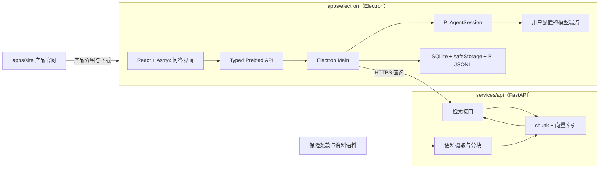

# 钩玄 实施方案

## 产品定位

钩玄是一款基于 RAG 的保险咨询问答系统，服务对象是不了解保险的人，回答三类问题：

- 哪些保险应该买。
- 哪些不必买、哪些属于重复配置。
- 什么样的产品适合自己所处的情况。

产品形态是对话问答。每条回答都要能回查到依据的条款或资料片段，让用户可以核对出处而不是被动接受结论。

v1 包含：客户端问答会话、服务端语料检索、来源展示、用户自定义模型端点、产品官网。

暂不包含：账号体系、云端会话同步、在线投保与下单、保单管理、健康告知与核保引导、需求画像问卷、移动客户端、遥测与自动更新。

## 架构



关键切分是**检索在服务端、生成在客户端**：

- 服务端只做语料、索引和检索，不调用生成模型，因此不持有任何用户凭据。
- 客户端的 API Key 由 `safeStorage` 加密、只在 Main 解密，检索片段与用户问题一起交给用户自己配置的模型生成回答。
- 更换模型不需要重新部署服务，流式、停止、重试与会话持久化由客户端运行时承担。

代价是完全离线不可用，且 embedding 需要服务端单独配置一套模型凭据。

## 仓库结构

pnpm workspace + turbo，根只负责编排，不放业务代码：

| 路径            | 标识                | 角色                | 工具链                      | 属于 workspace |
| --------------- | ------------------- | ------------------- | --------------------------- | -------------- |
| `apps/electron` | `@gouxuan/electron` | Electron 问答客户端 | electron-vite、React、TS    | 是             |
| `apps/site`     | `@gouxuan/site`     | 产品官网            | Vite、React                 | 是（待建）     |
| `services/api`  | `gouxuan-api`       | 语料摄取与检索服务  | Python、FastAPI、uv、Docker | 否             |

`services/api` 用 uv 管依赖、用 Docker 运行，不进 pnpm workspace：pnpm 只把含 `package.json` 的目录当包，turbo 的任务图也只从 workspace 包生成，纳进来就要在 Python 目录里永久放一个只做命令转发的假 `package.json`，而 turbo 对 Python 的实际收益接近零（缓存不了 `.venv`）。跨语言只有两件事要表达，都用更直白的方式：跑起来靠仓库根的 `compose.yml` 与 `compose.override.yml`，契约靠 `services/api/openapi.json` 进 git 后由客户端生成类型。

任务图不换 Nx：现在的形状是 3 个节点、1 条跨语言边，`nx affected` 在按 `paths` 过滤的 GitHub Actions 面前没有额外收益。触发点写在这里——`services/` 长出第二个可部署单元、CI 上线后全量构建开始拖时间、或 JS 包到 4 个以上；届时先迁 JS 再迁 Python。

workspace glob 是 `apps/*`，新增 JS 子包不需要再改结构定义。配置归属与任务编排的规则写在 `openspec/changes/setup-monorepo/design.md`。

## 客户端

当前 `apps/electron` 是 electron-vite 模板骨架，下面描述的是目标形态，Pi 运行时、Astryx 界面与 SQLite 持久化都尚未接入。

Electron 三进程，开启 `sandbox` 与 `contextIsolation`，关闭 `nodeIntegration`。

- Pi `AgentSession` 是唯一运行时，负责模型请求、工具循环、推理内容和会话 JSONL。
- Agent 只有一个工具：向服务端发起知识检索。检索结果作为资料注入上下文，模型据此回答。
- Provider 配置包含端点、模型和加密凭据，保存前校验 URL 与模型名，连接测试区分认证失败、模型不存在、限流、超时、网络失败和响应格式错误。
- 达到最大 Agent step 数后停止调用工具并保留已有结果；用户可以停止活动运行，也可以重跑最后一轮。
- SQLite 保存 Provider、会话索引和界面状态；Pi JSONL 保存消息、推理与工具结果。

## 检索服务

- 摄取：原始资料 → 规范化 → 按条款结构分块 → embedding → 索引，保留文档标题、条款定位和原文。
- 查询：接收问题文本，返回 top-k 片段、出处和相似度分数，不做生成。
- 存储：v1 用 SQLite 存 chunk 与向量、内存内余弦相似度；语料规模到十万级 chunk 再评估 pgvector。
- 契约：服务端导出 `openapi.json`，客户端按生成的类型调用，不手写重复的 DTO。
- 客户端配置服务端 Base URL，连接失败要区分服务不可达、鉴权失败和索引未就绪。
- 运行：镜像用 uv 多阶段构建（依赖层先装、源码层后拷），`compose.yml` 定义端口、健康检查与存索引的 named volume，`compose.override.yml` 挂 `app/` 源码跑 `--reload`。索引与语料不做 bind mount——macOS 跨 VM 挂载会拖慢热重载。基座用 `ghcr.io/astral-sh/uv:python3.13-bookworm-slim`（uv 与 Python 一体的镜像），因为开发网络到 `auth.docker.io` 直接 connection refused，用 `python:3.13-slim` 就无法构建；镜像里留了 `BASE` 构建参数以便切换。
- 检查不进容器：ruff、pytest 与契约生成在 host 用 uv 跑，容器只负责跑起来和可部署。

### 目录架构

```
services/api/
├─ pyproject.toml   uv.lock
├─ Dockerfile       .dockerignore
├─ openapi.json                    契约产物，进 git
├─ app/
│   ├─ main.py                     FastAPI 实例、路由挂载、异常 → 错误分类
│   ├─ settings.py                 索引路径、embedding 模型与维度、top_k、端口
│   ├─ openapi.py                  python -m app.openapi 导出契约
│   ├─ api/
│   │   ├─ health.py               GET /healthz（存活）与 /readyz（索引就绪）
│   │   └─ search.py               POST /v1/search
│   ├─ retrieval/
│   │   ├─ schemas.py              pydantic 请求/响应模型，契约唯一来源
│   │   ├─ service.py              问题 → embedding → 检索 → 组装片段
│   │   ├─ store.py                索引读写抽象
│   │   └─ chunking.py             按条款结构分块
│   ├─ embedding/
│   │   └─ client.py               OpenAI-compatible embeddings（服务端自己的凭据）
│   └─ ingest/
│       ├─ pipeline.py             原始资料 → 规范化 → 分块 → 向量 → 写索引
│       ├─ sources.py              语料清单与来源元数据
│       └─ cli.py                  python -m app.ingest.cli
├─ tests/                          conftest.py 建小样本索引 fixture
├─ eval/
│   ├─ golden.yaml                 问题 → 期望命中条款
│   └─ run.py                      召回率与命中率
└─ data/                           索引与 SQLite 产物，不进 git，容器挂 named volume
```

目录层面的约束：

- 这张树是目标形状。仓库里目前只有 `app/{main,settings,openapi}.py`、`app/api/health.py` 和 `tests/test_health.py`，`retrieval/`、`embedding/`、`ingest/`、`eval/` 是待建位置，没有对应代码就不建空包。

- 平铺 `app/`，不加 `src/`、不用具名包——这是只跑在自己容器里的应用，不会被安装。唯一回添具名包的条件：第二个 Python 单元进同一个 uv workspace 共享 venv。
- `ingest` 与在线检索共用 `retrieval/chunking.py` 与 `retrieval/store.py`。建索引与查询用了不同分块口径是 RAG 最常见的静默故障，指标正常但召回全错。
- 路由带 `/v1/`。桌面端更新慢，服务端要能并存两个版本。
- 存活与就绪分两个端点：`/healthz` 只报进程活着（compose 的健康检查用它），`/readyz` 在索引缺失时返回 503。合成一个端点会让容器在索引未建好时被判不健康、反复重启。
- `eval/golden.yaml` 与 `tests/` 是两类东西：前者是语料质量回归（改分块、换 embedding 模型都要跑），后者是代码正确性。
- 不铺 `routers/services/repositories/models` 分层，不建 `alembic/`——v1 索引是整库重建而不是原地迁移。

## 持续集成

GitHub Actions 按栈拆 workflow，用原生 `paths:` 过滤，不引入 affected 图工具：

| workflow     | 触发路径                           | 步骤                                                                                                   |
| ------------ | ---------------------------------- | ------------------------------------------------------------------------------------------------------ |
| `client.yml` | `apps/**`、根锁文件与 `turbo.json` | `pnpm install --frozen-lockfile` → `pnpm check` → `pnpm build`；跳过 Electron 二进制下载               |
| `site.yml`   | `apps/site/**`                     | 同上，只构建官网                                                                                       |
| `api.yml`    | `services/api/**`、`compose.yml`   | `uv sync --locked` → ruff + format check → pytest → 重新生成 `openapi.json` 比对 diff → `docker build` |

两条硬门禁：锁文件必须新鲜（`--frozen-lockfile` / `--locked`），契约产物必须与代码同步（重新生成后有 diff 即失败）。macOS 打包需要真二进制与签名凭据，由 tag 触发的独立 release workflow 承担，等 `prepare-v1-release` 再建。

本地入口统一在根 `package.json`：`pnpm dev`（客户端）、`pnpm check`、`pnpm build`、`pnpm package:mac`；检索服务另有 `pnpm dev:api`（`docker compose up api`）与 `pnpm check:api`（ruff + pytest）。CI 不读这些别名，别名写坏不影响门禁。

## 数据与标识

包名 `@gouxuan/*`，`productName` 为钩玄，`appId` 为 `com.openchic.gouxuan`，数据库文件与会话目录使用钩玄标识。安装包与压缩产物名固定 ASCII（`Gouxuan-<version>.dmg`），显示名与产物名允许不同，避免非 ASCII 文件名进入签名与公证链路。

## 许可

代码走 AGPL-3.0-only 单轨：商业形态是自己运营托管版收费，不需要对 B2B 发专有许可，因此也不要求贡献者签 CLA。分发桌面端即触发源码提供义务，具体写法与依赖扫描结果记在 README 的许可节。

保险语料、索引产物与评测集不在代码许可覆盖范围内，也不进公开仓库——它们是商业资产，授权线单独走（见待定问题 1）。

## 安全边界

- Renderer 使用严格 CSP，禁止远程脚本、远程页面、任意导航和新窗口。
- 客户端出站只允许两处：用户配置的模型端点和明确配置的服务端地址，均为 `https`，本地开发可用 `http://127.0.0.1`。
- API Key 只在 Main 解密使用，不进 Renderer、日志、崩溃信息或导出配置。
- 日志只记录脱敏后的运行 ID、错误类别和耗时，不记录问题正文与回答内容。
- 服务端返回的片段作为资料注入，不作为指令执行。

## 界面

- 左侧 `SideNav`：新对话与会话列表。
- 中间问答区：流式消息、停止、重跑、输入区。
- 回答下方展示引用片段与出处，可以展开查看原文定位。
- 设置页：模型端点、服务端地址与连接测试。
- 固定浅色主题，不跟随系统切换深色，不使用渐变，圆角 6–8px，列表保持桌面工具密度。

## 实施顺序

1. `setup-monorepo`：pnpm workspace（`apps/*`）与 turbo 任务编排、`@gouxuan/electron` 包名与钩玄标识、模板残留清理。
2. `build-qa-client`：接入 Pi `AgentSession`、Provider 配置与连接测试、SQLite 与 Pi JSONL 持久化、Astryx 问答界面，落实 sandbox 与 CSP 安全边界。
3. `add-knowledge-retrieval-service`：`services/api` 的摄取、索引、检索接口与契约，含 `Dockerfile`、根 `compose.yml` 与 `compose.override.yml`，以及 `.github/workflows/{client,api}.yml`（按 `paths` 过滤 + 契约 diff 门禁）。
4. `wire-insurance-qa-loop`：客户端接入检索工具，完成提问、流式回答与来源展示。
5. `publish-product-website`：建立 `apps/site`，官网内容与部署。
6. `prepare-v1-release`：签名、公证、离线边界与发布检查。

## 待定问题

开始实施前需要确认，规划里不预设答案：

1. 语料由谁准备，首批覆盖哪些险种和产品，原文能否对外分发。
2. 回答是否需要「不构成投保建议」类表述，以及展示位置。
3. 服务托管在哪（云主机、容器平台还是自己的机器）与鉴权方式。
4. embedding 模型、维度与所属端点。
5. 官网内容范围与托管方式。

## 验收标准

- 根目录一条命令构建 workspace 内全部 JS 子包，客户端安装包不含官网文件，官网依赖树不含 Electron。
- 根目录一条命令可以单独启动任意一个栈（客户端、检索服务），不需要 `cd` 进子目录。
- 改 `services/api` 只触发 Python job，改 `apps/**` 只触发 JS job；`openapi.json` 与代码不同步时 CI 失败。
- 应用显示名为钩玄，`appId` 与用户数据目录使用新标识，产物文件名为 ASCII。
- 客户端只有会话导航、问答区和设置入口，没有编辑与工作区选择能力。
- 提问触发一次检索工具调用，回答与引用片段出自同一次运行事件流。
- 引用片段可以展开查看原文与出处，检索失败时回答明确说明未取到依据。
- 流式文本、工具调用、取消和错误都通过单一类型安全的 IPC 事件流展示。
- API Key 不出现在 Renderer、日志或明文数据库字段中。
