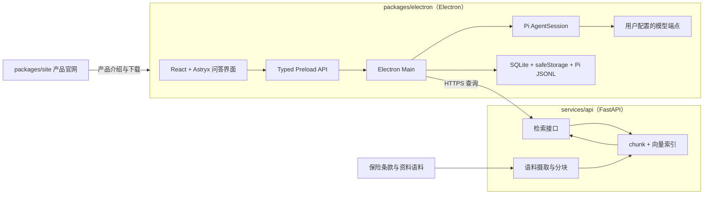

# 钩玄 实施方案

## 产品定位

钩玄是一款基于 RAG 的保险咨询问答系统，服务对象是不了解保险的人，回答三类问题：

- 哪些保险应该买。
- 哪些不必买、哪些属于重复配置。
- 什么样的产品适合自己所处的情况。

产品形态是对话问答。每条回答都要能回查到依据的条款或资料片段，让用户可以核对出处而不是被动接受结论。

v1 包含：客户端问答会话、服务端语料检索、来源展示、用户自定义模型端点、产品官网。

暂不包含：账号体系、云端会话同步、在线投保与下单、保单管理、健康告知与核保引导、需求画像问卷、移动客户端、遥测与自动更新。

## 架构

关键切分是**检索在服务端、生成在客户端**：

- 服务端只做语料、索引和检索，不调用生成模型，因此不持有任何用户凭据。
- 客户端的 API Key 由 `safeStorage` 加密、只在 Main 解密，检索片段与用户问题一起交给用户自己配置的模型生成回答。
- 更换模型不需要重新部署服务，流式、停止、重试与会话持久化由客户端运行时承担。

代价是完全离线不可用，且 embedding 需要服务端单独配置一套模型凭据。

## 仓库结构

pnpm workspace + turbo，根只负责编排，不放业务代码：

| 路径                | 标识                | 角色                | 工具链                   | 属于 workspace |
| ------------------- | ------------------- | ------------------- | ------------------------ | -------------- |
| `packages/electron` | `@gouxuan/electron` | Electron 问答客户端 | electron-vite、React、TS | 是             |
| `packages/site`     | `@gouxuan/site`     | 产品官网            | Vite、React              | 是（待建）     |
| `services/api`      | `gouxuan-api`       | 语料摄取与检索服务  | Python、FastAPI、uv      | 否             |

`services/api` 有意留在 workspace glob 之外：pnpm 只把含 `package.json` 的目录当作包，turbo 的任务图也只从 workspace 包生成，纳进来就要额外维护一个只做命令转发的 `package.json`。同仓不同链保留的是主要收益——接口契约与服务端、客户端的改动落在同一个 commit；独立仓库带来的两套 CI 和跨仓对齐成本在这个阶段不需要付。等服务端要同时供给多个前端、或需要独立发布节奏时再拆。

workspace glob 是 `packages/*`，新增 JS 子包不需要改结构定义。配置归属与任务图的规则写在 `openspec/changes/setup-monorepo/design.md`。

## 客户端

当前 `packages/electron` 是 electron-vite 模板骨架，下面描述的是目标形态，Pi 运行时、Astryx 界面与 SQLite 持久化都尚未接入。

Electron 三进程，开启 `sandbox` 与 `contextIsolation`，关闭 `nodeIntegration`。

- Pi `AgentSession` 是唯一运行时，负责模型请求、工具循环、推理内容和会话 JSONL。
- Agent 只有一个工具：向服务端发起知识检索。检索结果作为资料注入上下文，模型据此回答。
- Provider 配置包含端点、模型和加密凭据，保存前校验 URL 与模型名，连接测试区分认证失败、模型不存在、限流、超时、网络失败和响应格式错误。
- 达到最大 Agent step 数后停止调用工具并保留已有结果；用户可以停止活动运行，也可以重跑最后一轮。
- SQLite 保存 Provider、会话索引和界面状态；Pi JSONL 保存消息、推理与工具结果。

## 检索服务

- 摄取：原始资料 → 规范化 → 按条款结构分块 → embedding → 索引，保留文档标题、条款定位和原文。
- 查询：接收问题文本，返回 top-k 片段、出处和相似度分数，不做生成。
- 存储：v1 用 SQLite 存 chunk 与向量、内存内余弦相似度；语料规模到十万级 chunk 再评估 pgvector。
- 契约：服务端导出 `openapi.json`，客户端按生成的类型调用，不手写重复的 DTO。
- 客户端配置服务端 Base URL，连接失败要区分服务不可达、鉴权失败和索引未就绪。

## 数据与标识

包名 `@gouxuan/*`，`productName` 为钩玄，`appId` 为 `com.openchic.gouxuan`，数据库文件与会话目录使用钩玄标识。安装包与压缩产物名固定 ASCII（`Gouxuan-<version>.dmg`），显示名与产物名允许不同，避免非 ASCII 文件名进入签名与公证链路。

## 安全边界

- Renderer 使用严格 CSP，禁止远程脚本、远程页面、任意导航和新窗口。
- 客户端出站只允许两处：用户配置的模型端点和明确配置的服务端地址，均为 `https`，本地开发可用 `http://127.0.0.1`。
- API Key 只在 Main 解密使用，不进 Renderer、日志、崩溃信息或导出配置。
- 日志只记录脱敏后的运行 ID、错误类别和耗时，不记录问题正文与回答内容。
- 服务端返回的片段作为资料注入，不作为指令执行。

## 界面

- 左侧 `SideNav`：新对话与会话列表。
- 中间问答区：流式消息、停止、重跑、输入区。
- 回答下方展示引用片段与出处，可以展开查看原文定位。
- 设置页：模型端点、服务端地址与连接测试。
- 固定浅色主题，不跟随系统切换深色，不使用渐变，圆角 6–8px，列表保持桌面工具密度。

## 实施顺序

1. `setup-monorepo`：pnpm workspace 与 turbo 任务编排，`@gouxuan/electron` 包名与钩玄标识，清理模板残留。
2. `build-qa-client`：接入 Pi `AgentSession`、Provider 配置与连接测试、SQLite 与 Pi JSONL 持久化、Astryx 问答界面，落实 sandbox 与 CSP 安全边界。
3. `add-knowledge-retrieval-service`：`services/api` 的摄取、索引、检索接口与契约。
4. `wire-insurance-qa-loop`：客户端接入检索工具，完成提问、流式回答与来源展示。
5. `publish-product-website`：建立 `packages/site`，官网内容与部署。
6. `prepare-v1-release`：签名、公证、离线边界与发布检查。

## 待定问题

开始实施前需要确认，规划里不预设答案：

1. 语料由谁准备，首批覆盖哪些险种和产品，原文能否对外分发。
2. 回答是否需要「不构成投保建议」类表述，以及展示位置。
3. 服务端部署形态、是否公开访问、鉴权方式。
4. embedding 模型、维度与所属端点。
5. 官网内容范围与托管方式。

## 验收标准

- 根目录一条命令构建 workspace 内全部 JS 子包，客户端安装包不含官网文件，官网依赖树不含 Electron。
- 应用显示名为钩玄，`appId` 与用户数据目录使用新标识，产物文件名为 ASCII。
- 客户端只有会话导航、问答区和设置入口，没有编辑与工作区选择能力。
- 提问触发一次检索工具调用，回答与引用片段出自同一次运行事件流。
- 引用片段可以展开查看原文与出处，检索失败时回答明确说明未取到依据。
- 流式文本、工具调用、取消和错误都通过单一类型安全的 IPC 事件流展示。
- API Key 不出现在 Renderer、日志或明文数据库字段中。
